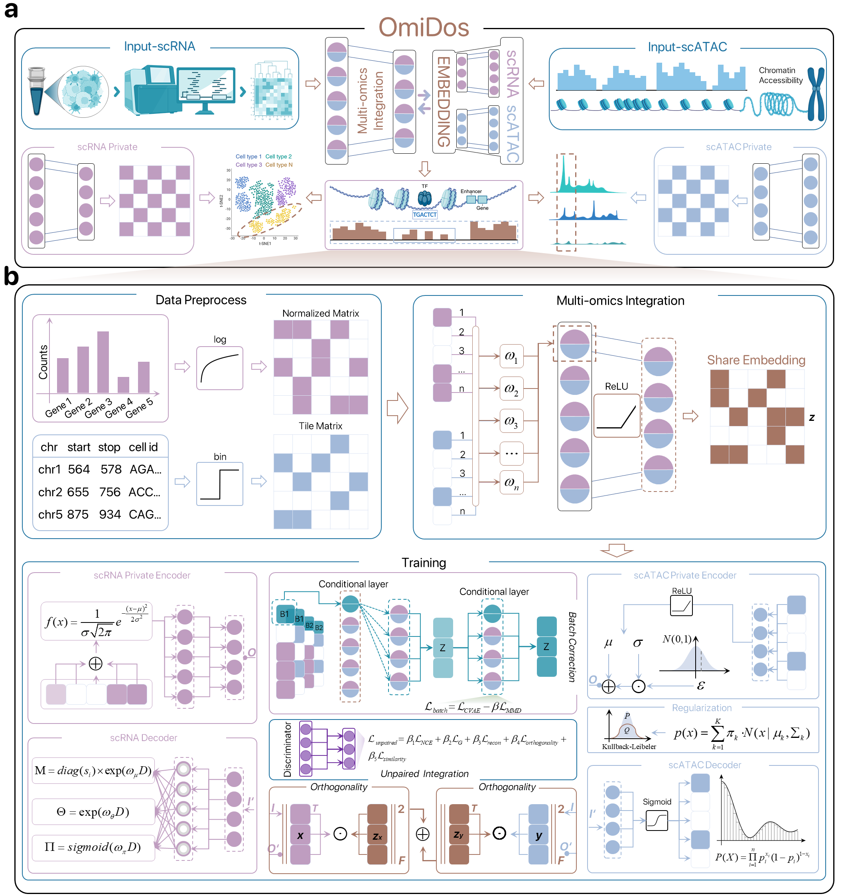

<h2 align="center">
OmiDos: Dissecting Private and Shared Signatures of Single-Cell Multi-Omics Data with Dynamic Orthogonal Deep Generative Model
</h2>

<p align="center">
  <a href="https://github.com/fanyi21/OmiDos">
    
  </a>
  <a href='https://depf.readthedocs.io/en/latest/'>
    
  </a>
  <a href="https://github.com/fanyi21/OmiDos/stargazers">
    
  </a>
  <a href="https://github.com/fanyi21/OmiDos/network/members">
    
  </a>
  <a href="https://github.com/fanyi21/OmiDos/issues">
    
  </a>
  <a href="https://github.com/fanyi21/OmiDos/blob/main/LICENSE">
    
  </a>
  <a href="https://github.com/fanyi21/OmiDos/graphs/traffic">
    
  </a>
  <!-- ALL-CONTRIBUTORS-BADGE:START - Do not remove or modify this section -->
<a href="https://github.com/fanyi21/DEPF/graphs/contributors"></a>
<!-- ALL-CONTRIBUTORS-BADGE:END -->
</p>


Release: 
  <a href="https://github.com/fanyi21/OmiDos/tree/main/OmiDos">Source</a>
  
  <!-- Links:
  <a href="https://depf.readthedocs.io/en/latest/Description.html">Getting Started</a> |
  <a href="https://depf.readthedocs.io/en/latest/runHA.R.html#">API Reference</a> |
  <a href="https://depf.readthedocs.io/en/latest/Spectral_usage.html">Examples</a> -->
  


***OmiDos:*** Here, we introduce OmiDos, a novel **dynamic orthogonal deep generative model**, specifically designed to **disentangle shared and unique molecular signatures** across multi-omics layers in single-cell multi-omics data. Unlike prior methods that rely on simplistic assumptions about shared features, OmiDos leverages **deep transfer learning** to extract invariant shared signals from paired data while enforcing **orthogonality constraints** to separate modality-specific signals into distinct latent spaces. To address unpaired data, OmiDos incorporates an **adversarial discriminator** combined with **noise contrastive estimation**. Furthermore, OmiDos features a decoder layer enhanced by a **maximum mean discrepancy regularization**, enabling robust batch correction across diverse experimental conditions.. 



The key highlights of our work are:
- &#x1F31E; ***OmiDos Elevates Cell Type Discovery through Private Embedding to Shared Embedding Transfer***. By incorporating both private and shared embeddings, OmiDos enhances the resolution of cellular heterogeneity, facilitating the identification of potentially novel cell populations.
- &#x1F31E; ***OmiDos Deciphers Regulatory Programs by Leveraging Private Embedding to Enhance the Signatures in the Shared Embedding***. The features captured in the private embedding enhance the signal in the shared embedding, leading to the annotation of a potential enhancer. Its activity strongly correlates with the regulatory dynamics observed in E13.5 and E14.5 epithelial cell differentiation and migration.
- &#x1F34E; ***OmiDos Mitigates Batch Effects while Preserving Regulatory Signals***. OmiDos not only balanced batch correction but also preserved the regulatory signals necessary for accurate cell type resolution across both modalities. Additionally, it accurately identifies cell-type-specific regulatory elements across immune cell populations, ensuring biologically meaningful integration.
- &#x1F31E; ***OmiDos Reduces Unpaired-Specific Biases to Infer Cell Lineages***. OmiDos effectively integrates unpaired multi-omics data, ensuring optimal cell type alignment across modalities while preserving distinct cell lineage structures. The shared embedding revealed significant cell lineage relationships, confirming that OmiDos maintains expected biological associations while mitigating biases associated with unpaired data.
- &#x1F34E;  ***OmiDos Captures Cancer-specific Epigenome for Medulloblastoma Progression***. In a targeted application to the Sonic Hedgehog medulloblastoma mouse model, OmiDos identified a critical regulatory shift from reliance on distal regulatory elements during early development to a preference for proximal elements in the tumor stage, delineating a dynamic transition essential for understanding tumor progression.


<!-- ## Getting Started
 -->

## Table of Contents

- [Installation](#installation)
- [Example](#Example)

### Installation
It is recommended to use **git** for installation.  
```shell
# create a virtual environment named OmiDos
$ conda create -n OmiDos 
``` 
```shell  
# activate the environment       
$ conda activate OmiDos 
``` 
```shell 
# install R enviroment
$ conda install -c conda-forge r-base=4.1.3
$ conda install -c conda-forge r-devtools
$ conda install -c conda-forge r-seurat
$ conda install python=3.9
$ pip install leidenalg
```
```shell
# clone OmiDos repository                  
$ git clone https://github.com/fanyi21/OmiDos.git
```
```shell
# Install OmiDos
$ python setup.py install 
```
### Example
 &#x1F341; In a mouse secondary palate development dataset, **OmiDos** precisely identified a critical enhancer at the genomic locus chr16: 32697085-32697585, elucidating its essential role in regulating \emph{Muc4} expression. Its activity strongly correlates with the regulatory dynamics observed in E13.5 and E14.5 epithelial cell differentiation and migration..
```shell
$ cd OmiDos/Analysis/
$ run notebook
```
<!-- &#x1F341; ***Step 2***: Selecting a basic clustering algorithm to generate a clustering ensemble. DEPF provides three basic clustering algorithms, including ***Louvain***, ***Leiden***, and ***spectral clustering***.
- &#x1F346; ***Louvain***. The ***Louvain_resolution_1.csv*** is produced and saved in the ***./OutputData***.
```r
$ cd DEPF/HierarchicalAutoencoder/
source("runLouvain.R")
#res: resolution
runLouvain(res=1, ensemble_num=10) 
``` -->
<!-- - &#x1F346; ***Leiden***. The ***Leiden_resolution_1.csv*** is produced and saved in the ***./OutputData***.
```r
$ cd DEPF/HierarchicalAutoencoder/
source("runLleiden.R")
#res: resolution
runLeiden(res=1, ensemble_num=10) 
``` -->
<!-- - &#x1F346; ***spectral clustering***. The ***spectral_cluster_K_10.csv*** is produced and saved in the ***./OutputData***.
```matlab
$ cd DEPF/BiobjectiveFruitFlyOptimizationAlgorithm/
% K: cluster number; T: ensemble size
runSpectral(K=10, T=10) 
``` -->
<!-- &#x1F341; ***Step 3***: Performing dynamic ensemble pruning. The ***final_clustering.csv*** is produced and saved in the ***./OutputData***.
```matlab
$ cd DEPF/BiobjectiveFruitFlyOptimizationAlgorithm/
runBioFOA("spectral", 10, 1)
% output
NMI: 0.8900
ARI: 0.9100
``` -->
<!-- > **Note: `OmiDos` is still under development, please see [API reference](https://depf.readthedocs.io/en/latest/runHA.R.html#) for the latest list.** -->

## Contact:
Thank you for using OmiDos! Any questions, suggestions or advices are welcome.

email address:[lixt314@jlu.edu.cn](lixt314@jlu.edu.cn), [fanyi21@mails.jlu.edu.cn](fanyi21@mails.jlu.edu.cn)

